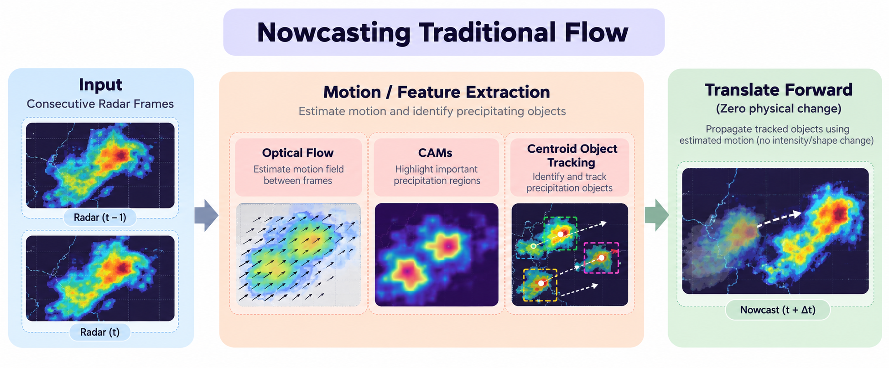
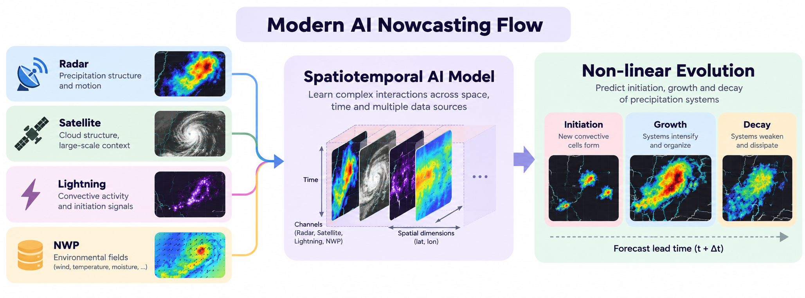

# SIH 2026 : ByteCraft_FC

This repository is maintained by the SIH team **ByteCraft_FC** representing the Computer Science Department, Fergusson College (Autonomous), Pune. 

# Hackathon - ByteCraft
This repository contains the approach, design and possible solutions for the Smart India Hackathon 2026 - Problem Statement - SIH26072.

## SIH26072 - AI-ML based Nowcasting of thunderstorm and lightning using atmospheric observation including multiple radars, satellite, lightning and model data:
This notebook will discuss Nowcasting techniques using Machine learning and AI-models and how they can be efficient in short period forecast and weather changes without relying on large scale simulation models that can take way long to run and make predictions.

### What is **Nowcasting**?:

**Nowcasting** is a high-speed, hyper-local weather forecasting technique for immediate future - typically covering 0-6 hours.

### How is it different from standard forecasting techniques?

Standard weather forecasting techniques are for predicting the weather over a longer period like days and weeks even while Nowcasting techniques are for shorter periods to give a quick prediction of what is around the corner for the day.

> **Example Analogy:** If standard weather forecasting is like predicting where a marathon runner will be three hours from now based on their pacing and training, nowcasting is like tracking where a sprinter will step in next ten seconds by watching their balance, muscle tension and foot placement.

### Drawbacks with Traditional Weather Forecasts:

Traditional weather forecasting relies heavily on giant numerical simulations called **Numerical Weather Predictions(NWP)**. These models take observations across the entire planet, solve complex fluid dynamics and thermodynamics equations and tells us what the weather is going to be tomorrow or day after tomorrow.

While this is incredibly accurate in predicting the weather patterns on the long run - it falls short for certain sudden changes in the weather, that break predefined models - like an **anomaly** or an **edge-case**.

Thunderstroms and sudden downpours have such two characterisitcs that can break traditional models:

1. **They are short lived and localised:** A severe thunderstorm cloud can form, dump heavy rains, drop lighting and completely dissipate within 45-90 minutes across an area just 5-15 KMs wide. This is extremely difficult for a large simulation model specifically designed to predict results for a larger surface area and longer periods of time.

2. **They take too long to compute:** Gathering data, cleaning it and running large scale simulations on a global or regional supercomputer cluster takes a lot of time. By the time the forecast is calculated, the storm has hit and already vanished.

### How traditional Nowcasting works?

Instead of running slow physics simulations from scratch, traditional nowcasting operates near real time by doing these three basic operations:

1. **Where is the storm right now?**: Sensors like **Doppler radar** (which spots rain droplets and wind inside clouds) and **Satellites** (which look at cloud temperature from the space) update every 5-10 minutes.

2. **Where is it moving?**: By comparing snapshots from 10 minutes ago, 5 minutes ago and right now, algorithms calculate and storm's velocity vector and extrapolate its path forward predicting where it is going next.

3. **Is it growing, dying or about to form?**: This is the hardest part. A storm isn't moving in a straight line or have the same size (like a ball moving across a table), instead it can suddenly change direction, intensify in size, turn into a severe hailstorm or evaporate into a severe hailstorm or evaporate into thin air within 20 minutes depending on local temperature, humidity, and rising warm air.

Conventional operational nowcasting methods have been implementing three main techniques:

#### Centroid and Object Tracking:

- **Mechanism:** Algorithms identify isolated storm cells by thresholding radar reflectivity and fit them into geometric ellipsoids or polygons. **Note: Why??**

- **Tracking:** By matching centroids between sequential radar scans (every 5-10 mins) using distance minimisation or overlap, the algorithm computes a translation vector ($Δx, Δy$) and projects the polygon forward.

- **Limitation:** Treats storms as rigid objects. It struggles when cells undergo splitting, merging, or rapid spatial deformation.

#### Optical Flow and Eulerian-Lagrangian Advection:

- **Mechanisms:** Instead of tracking segmented objects, optical flow algorithms estimate a dense, 2D continous motion field ($u, v$) across every pixel of consecutive radar or satellite grids.

- **Extrapolation:** The current reflectivity field $\textit{I}(x,y,t)$ is advected forward using a semi-Lagrangian scheme along the calculated velocity vectors:

$$
\dfrac{dI}{dt} ≈ 0 \implies I(x + uΔt, y + vΔt, t + Δt) ≈ I(x,y,t)
$$

- **Stochastic Extensions:** Systems like **STEPS** decompose precipitation into spatial cascade levels (filtering by spatial frequency) and add autoregressive noise to mimic predictability decay over time.

- **Limiatations:** Pure advection assumes precipitation intensity is conserved along the motion trajectory. It is blind to **Convective Initiation(CI)** (birth of new cells) and **dissipation** (cell decay).

#### Rapid Update Convective-Allowing Models (CAMs):

**Mechanism:** Running localised, non-hydrostatic numerical weather prediction (NWP) models (e.g: HRRR, localised WRF) with grid spacings of 1-3 KMs and frequent data assimilation cycles (hourly or sub-hourly).

**Limitations:**
1. **Latency:** Data assimilation and running differential equations still take a long time.

2. **Spin-up Error:** Newly ingested radar echoes can take 15-30 simulation minutes to balance with model microphysics and thermodynamics, during which precipitation forecasts are unreliable.

### Nowcasting with AI and Machine/Deep Learning Methods:

Machine/Deep Learning models can modernise by moving beyong simple kinematic motion tracking to learning the non-linear, multi-scale physical evolution of convective systems directly from multi-modal sensor streams.

#### Traditional Nowcating Flow:

#### Modern AI Flow:

## Our Approach: Implementation 